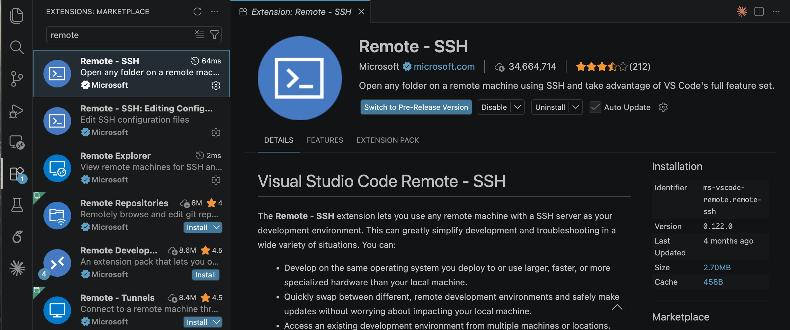

# STAT 695: Training ResNet on Purdue Gilbreth with VSCode

This tutorial covers two things:

1. **How to use Gilbreth** — connect from VSCode, set up your environment, and submit jobs
2. **How to train a ResNet model** — run the provided training script on CIFAR-10 end-to-end

## Prerequisites

- A Purdue career account with Gilbreth access (request via [RCAC](https://www.rcac.purdue.edu/account/request))
- [VSCode](https://code.visualstudio.com/) installed on your local machine

---

# Part 1: How to Use Gilbreth

## 1.1 Connect to Gilbreth via VSCode Remote-SSH

### Step 1: Install the Remote-SSH Extension

Open VSCode, go to the Extensions tab (`Ctrl+Shift+X`), and install:

```
ms-vscode-remote.remote-ssh
```



Also install the **Python** extension (`ms-python.python`) for code editing support.

### Step 2: Configure SSH

There are two options to set up SSH config:
 (1) Open your local SSH config file directly. On Mac/Linux: `~/.ssh/config`. On Windows: `C:\Users\<you>\.ssh\config`.
 (2) Open VSCode, go to the Remote Explorer tab, click the gear icon, and select your SSH config file.

Add this block (replace `YOUR_USERNAME` with your Purdue career account `lastnamexxx`):

```
Host gilbreth
    HostName gilbreth.rcac.purdue.edu
    User YOUR_USERNAME
    ConnectTimeout 60
```

### Step 3: First Time Connect

1. Open the VSCode Terminal
2. Type `ssh gilbreth` and enter
3. Enter your Purdue ID passcode. If you use Duo push to authorize, add `,push` after your passcode
4. Authenticate with your Purdue credentials

VSCode will install its server component on first connection. This takes about a minute.

### Step 4: Verify

Open the VSCode integrated terminal (`` Ctrl+` ``) and run:

```bash
hostname
```

You should see something like `gilbreth-fe00.rcac.purdue.edu`. This confirms you are on a Gilbreth **login node**.

> **Warning**: Do NOT run training or heavy computation on login nodes. Always use SLURM (see Section 2.0).

### Step 5: Login without Passcode (SSH Key)

To avoid entering your passcode every time, set up SSH key authentication. You should already be logged into Gilbreth from Step 3.

**1. Generate an SSH key pair on Gilbreth** (in the terminal you already have open):

```bash
ssh-keygen -t ed25519
```

Press `Enter` three times to accept the default path and skip the passphrase.

**2. Add the public key to authorized keys:**

```bash
cat ~/.ssh/id_ed25519.pub >> ~/.ssh/authorized_keys
chmod 600 ~/.ssh/authorized_keys
```

**3. Copy the private key to your local machine.** Print the key on Gilbreth:

```bash
cat ~/.ssh/id_ed25519
```

On your **local machine**, create the file `~/.ssh/id_ed25519_gilbreth`, paste the output into it, and set permissions:

- Mac/Linux:
  ```bash
  chmod 600 ~/.ssh/id_ed25519_gilbreth
  ```
- Windows (PowerShell):
  ```powershell
  icacls $env:USERPROFILE\.ssh\id_ed25519_gilbreth /inheritance:r /grant:r "$($env:USERNAME):(R)"
  ```

**4. Update your local SSH config** (the file from Step 2) to use the key:

```
Host gilbreth
    HostName gilbreth.rcac.purdue.edu
    User YOUR_USERNAME
    IdentityFile ~/.ssh/id_ed25519_gilbreth
    ConnectTimeout 60
```

Now VSCode Remote-SSH will connect without a passcode.

---

## 1.2 Set Up the Python Environment

Run the following commands in the VSCode terminal (on the Gilbreth login node).

### Step 1: Install Miniconda 3

We recommend installing your own Miniconda 3 in your `$HOME` so the installer can set up `conda init` for you. Miniconda itself is small (~500 MB); only the *packages and environments* are big, and we keep those small with the conda config below.

```bash
# Start in your home directory
cd ~

# Download the latest Miniconda 3 installer for Linux x86_64
wget https://repo.anaconda.com/miniconda/Miniconda3-latest-Linux-x86_64.sh

# Run the installer
bash Miniconda3-latest-Linux-x86_64.sh
```

During the installer prompts:
- Press `Enter` to review the license, then type `yes` to accept it
- When asked for the install location, accept the default `/home/YOUR_USERNAME/miniconda3`
- When asked whether to run `conda init`, type `yes`

To make sure the module environment is cleaned and CUDA is loaded **every time** you start a new shell, append the following lines to the end of your `~/.bashrc`:

```bash
# Clean module environment and load CUDA for GPU support
module --force purge
module --force unload xalt
```

> The `xalt` module is loaded by default on Gilbreth and can interfere with conda/pip; force-unloading it avoids subtle issues. `--force` ensures sticky modules are also removed.

Reload your shell so `conda` is on `PATH`:

```bash
source ~/.bashrc
```

Verify the install:

```bash
which conda
conda --version
```

> If you prefer to use the cluster-provided Anaconda instead of your own install, you can skip Step 1 and run `module load anaconda` before the next step. The Miniconda 3 route is preferred because it gives you full control of the installation and avoids module conflicts.


Now create the conda environment:

```bash
# Create a new conda environment with Python 3.10
conda create -n stat695 python=3.10 -y

# Activate the environment
conda activate stat695

# Install PyTorch (with CUDA support) and torchvision
pip install torch torchvision

# Verify installation
python -c "import torch; print('PyTorch version:', torch.__version__); print('CUDA available:', torch.cuda.is_available())"
```

### Step 2: Select the Python Interpreter in VSCode

1. `Ctrl+Shift+P` > `Python: Select Interpreter`
2. Choose the `stat695` conda environment from the list


## 1.3 Tips

- **Use `screen` for persistent sessions**: Login node sessions can disconnect. Start a `screen` session so your terminal survives:
  ```bash
  screen -S stat695      # create a session
  screen -dr stat695   # reattach after disconnect
  ```
- **Storage layout**:
  | Path | Use For | Quota |
  |------|---------|-------|
  | `$HOME` | Code, configs | Small (25 GB) |
  | `/scratch/gilbreth/$USER/` | Datasets, checkpoints, large envs | Large (temporary) |

  Scratch is purged periodically — back up important results.

- **Soft Link**:
  If your home directory runs out of space, create folders on scratch (`/scratch/gilbreth/$USER/`). For example:
  ```bash
  mkdir -p /scratch/gilbreth/$USER/data
  ln -s /scratch/gilbreth/$USER/data ./data
  ```
  `$USER` automatically expands to your Purdue username — no need to substitute manually.

- **Avoid module conflicts**: Always run `module purge` before loading modules.

---

# Part 2: Train a ResNet Model on Gilbreth
## 2.0 SLURM: Submit and Manage Jobs
Refer to the [RCAC Gilbreth "Running Jobs" guide](https://www.rcac.purdue.edu/knowledge/gilbreth/run) for the full list of queues, partitions, and submission options — the snippets below cover the common cases for this class.

> **Tip — find your allocation name with `myquota`.** Run `myquota` on the login node and look at the rows with `Type = depot`. The `Location` column is your allocation name. For example, STAT students should see `statdept` — that is the value to plug into `-A YOUR_ALLOCATION` in the table below.

| Flag | Required? | Meaning |
|------|-----------|---------|
| `-A YOUR_ALLOCATION` | required | Your compute allocation name (see the `myquota` tip above — STAT students use `statdept`) |
| `-N 1` | required | Number of nodes (1 is almost always what you want) |
| `-n 4` | required | Number of CPU cores |
| `--gpus-per-node=1` | required | Number of GPUs per node |
| `--mem=50G` | required | Memory per node (e.g. `50G` requests 50 GB of RAM) |
| `-t 02:00:00` | required | Wall-clock time limit in `HH:MM:SS` (maximum is `04:00:00`) |
| `-p a30` | optional | Request a specific GPU type (e.g. `a30`); omit to let SLURM pick any available GPU |

## 2.1 Quick Start
```
mkdir -p ~/project
cd ~/project
git clone https://github.com/INSTRUCTOR/stat695.git stat695
cd stat695
```
Datasets and checkpoints are too large for `$HOME` (25 GB quota). Store them on scratch (effectively unlimited) and create symbolic links so `./data` and `./checkpoints` inside the repo still resolve to the scratch copies — that way `train.py` can keep its default paths and you can browse the files from VSCode as if they were local.

```bash
# Create the real folders on scratch
mkdir -p /scratch/gilbreth/$USER/stat695/data
mkdir -p /scratch/gilbreth/$USER/stat695/checkpoints

# From the repo root (~/project/stat695), link them in
ln -s /scratch/gilbreth/$USER/stat695/data ./data
ln -s /scratch/gilbreth/$USER/stat695/checkpoints ./checkpoints
```

### Option 1: Interactive Session (for debugging and short experiments)
```bash
sinteractive -A YOUR_ALLOCATION -n 4 -N 1 --gpus-per-node=1 --mem=50G -t 02:00:00
```
Once on the compute node, activate your environment and run the jobs:

```bash
cd ~/project/stat695
conda activate stat695
sh run.sh
```
### Option 2: Batch Job Script

For longer training runs, create a shell script `run.sh` in the repo root:

```bash
#!/bin/bash
#SBATCH --job-name=stat695_train
#SBATCH --account=YOUR_ALLOCATION
#SBATCH --nodes=1
#SBATCH --ntasks=4
#SBATCH --gpus-per-node=1
#SBATCH --mem=50G
#SBATCH --time=04:00:00
#SBATCH --output=logs/%j.out
#SBATCH --error=logs/%j.err

# Activate environment
conda activate stat695

# Run training
python train.py --model resnet18 --epochs 10 --lr 0.01 --batch_size 128 --pretrained
```

Submit the job:

```bash
mkdir -p logs
sbatch run.sh
```

Edit the `#SBATCH` directives at the top of `run.sh` to tune the submission — e.g. change `--time`, `--mem`, `--gpus-per-node`, or add `#SBATCH -p a30` to request a specific GPU type. The flags accepted are the same ones documented in the Interactive Session table above; `sbatch` simply reads them from the script header instead of the command line.


## 2.2 Repository Structure

```
stat695/
├── README.md       # This tutorial
├── resnet.py       # ResNet model definitions
├── train.py        # Training script (CIFAR-10)
└── run.sh          # SLURM batch script (you create this)
```

## 2.3 Model Overview (`resnet.py`)

Three model architectures are provided:

| Class | Output Dim | Description |
|-------|-----------|-------------|
| `ResNet18` | 512 | Lightweight, fast to train |
| `ResNet50` | 2048 | Standard backbone for vision tasks |
| `ResNeXt50_32x4d` | 2048 | Grouped convolutions, better accuracy |

**Constructor parameters:**
- `pretrained` (bool): Load ImageNet pretrained weights
- `mapping_feat_dim` (int or None): Project features to a different dimension before the FC layer

**Forward pass flags:**
- `get_feat=True`: Return `(features, logits)` instead of just `logits`
- `get_ha=True`: Return hidden activations from each residual block
- `get_ha_x=True`: Include the stem output in hidden activations

## 2.4 Training Script (`train.py`)

The provided `train.py` is a complete, self-contained script that:
- Loads CIFAR-10 with standard ImageNet normalization
- Instantiates a model from `resnet.py` and replaces the FC layer for 10 classes
- Trains with SGD + cosine annealing LR schedule
- Evaluates on the test set after each epoch
- Saves the best checkpoint to `checkpoints/`

### Command-Line Arguments

```
python train.py --help
```

| Argument | Default | Description |
|----------|---------|-------------|
| `--model` | `resnet18` | `resnet18`, `resnet50`, or `resnext50` |
| `--epochs` | `10` | Number of training epochs |
| `--batch_size` | `128` | Batch size |
| `--lr` | `0.01` | Learning rate |
| `--momentum` | `0.9` | SGD momentum |
| `--weight_decay` | `5e-4` | Weight decay |
| `--data_dir` | `./data` | Where to download/store CIFAR-10 |
| `--save_dir` | `./checkpoints` | Where to save model checkpoints |
| `--num_workers` | `4` | DataLoader workers |
| `--pretrained` | off | Use ImageNet pretrained weights |

> **Warning**: `./data` and `./checkpoints` will grow far beyond the 25 GB `$HOME` quota. Put the real folders on scratch and symlink them in — see Section 2.1 for the exact commands.

---

## 2.5 Run Training Step by Step

### Option A: Interactive Session

```bash
# 1. Request a GPU node
sinteractive -A YOUR_ALLOCATION -n 4 -N 1 --gpus-per-node=1 --mem=50G -t 02:00:00

# 2. Activate the environment
conda activate stat695

# 3. Navigate to the project
cd ~/project/stat695

# 4. Train ResNet18 on CIFAR-10 (with pretrained weights)
python train.py --model resnet18 --epochs 10 --lr 0.01 --batch_size 128 --pretrained

# 5. (Optional) Train ResNet50
python train.py --model resnet50 --epochs 10 --lr 0.01 --batch_size 64 --pretrained
```

> Use `--batch_size 64` for ResNet50/ResNeXt50 if you run into GPU out-of-memory errors.

### Option B: Batch Job

```bash
# Create and submit the batch script
sbatch run.sh

# Monitor the job
squeue -u $USER

# View live output
tail -f logs/<JOB_ID>.out
```

## 2.6 Expected Output

When training runs successfully, you will see output like this:

```
Using device: cuda
Loading CIFAR-10 dataset...
Train samples: 50000, Test samples: 10000
Model: resnet18 | Parameters: 11,181,642

Starting training for 10 epochs...

Epoch | Train Loss | Train Acc | Test Loss | Test Acc |       LR
-----------------------------------------------------------------
    1 |     1.2345 |   55.32%  |    0.9876 |  65.10%  | 0.010000
    2 |     0.7890 |   72.45%  |    0.7234 |  75.30%  | 0.009755
    3 |     0.5678 |   80.12%  |    0.5987 |  79.80%  | 0.009045
  ...
   10 |     0.1234 |   95.67%  |    0.3456 |  88.50%  | 0.000245

Training complete. Best test accuracy: 88.50%
Best checkpoint saved to: ./checkpoints/resnet18_best.pth
```

> Exact numbers will vary. With pretrained weights and 10 epochs, expect ~85-90% test accuracy on CIFAR-10 with ResNet18.

## 2.7 Load a Saved Checkpoint

To load a trained model for inference or further training:

```python
import torch
from resnet import ResNet18

model = ResNet18(pretrained=False)
model.fc = torch.nn.Linear(model.fc.in_features, 10)

checkpoint = torch.load("checkpoints/resnet18_best.pth")
model.load_state_dict(checkpoint["model_state_dict"])
print(f"Loaded checkpoint from epoch {checkpoint['epoch']} "
      f"with test accuracy {checkpoint['test_acc']:.2f}%")

model.eval()
```

---

## References

- [Purdue RCAC Gilbreth User Guide](https://www.rcac.purdue.edu/knowledge/gilbreth)
- [SLURM Documentation](https://slurm.schedmd.com/documentation.html)
- [VSCode Remote-SSH](https://code.visualstudio.com/docs/remote/ssh)
- [PyTorch Installation](https://pytorch.org/get-started/locally/)
- He et al., "Deep Residual Learning for Image Recognition" (2015)
